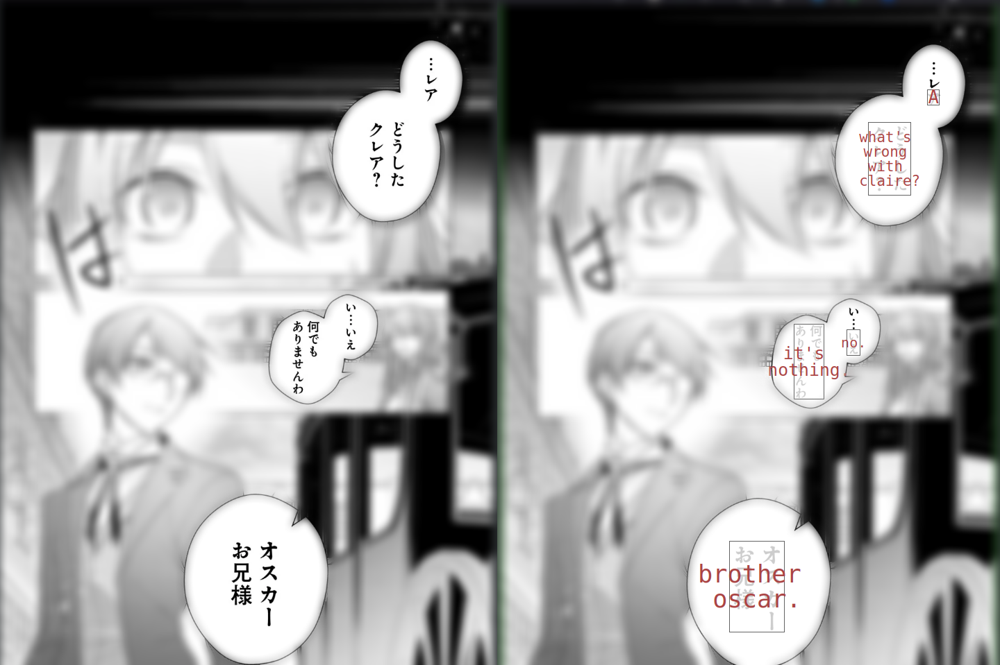
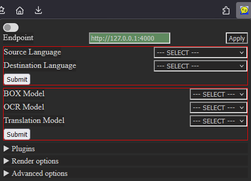

# OCR_extension

This is a browser extension for running in-place translation of images in an active tab.
The extension, when activated on a tab, will grab all existing and new images and send them to a [backend server](https://github.com/Crivella/ocr_translate), that will perform the OCR and translation.
The server will reply with a list of textboxes, that the extension will overlay on top of the image

## Intended use

The idea behind this project, is to have a self-hosted instance of the [backend server](https://github.com/Crivella/ocr_translate), which, by using pre-downloaded or self-generated/fine-tuned models is capable of running without any internet connection.

The purpose of the extension is also to control the state of the backend server by modifying the in-use:

- Source language
- Destination language
- Box OCR model
- Text OCR model
- Translation OCR model

## Installing the extension

### Install from from Mozilla add-ons

The extension is available on the [official Mozilla repository](https://addons.mozilla.org/addon/ocr_extension/)

### Build and install the extension manually

- Download the entire repo
- Using node v16 run (inside the main directory of the project)
  - `npm install`
  - `npm run build:prod`
- Type `about:debugging` in your address bar
- On the left click `This Firefox`
- Click `Load Temporary add-on`
- Select the `manifest.json` file inside the `extension` directory

## Usage

The extension will provide

- A pop-up menu in the extension bar 
- A *page action* to activate the extension in the current tab .
  - Activating the page action will signal the extension to grab all images on the page and add listeners to detect new images.
  - Deactivating the page action will (should) undo everything the extension did to modify the page, returning it to the original state.
- A `Translate text` option in the context menu of selected text to ask the server to translate the selection. The extension will then replace the selected text with the translated one (sperimental, still has trouble with new-lines).

By default the extension will try to query a local host backend server on port 4000.

The textboxes are interactive:

- Clicking on a textbox will copy the original (OCRed) text.
- Right-clicking will open a dedicated context-menu with the options to:
  - Close/Remove the textbox
  - Copy the original text
  - Copy the translated text
  - Query the server for other, already ran, translations (eg with different models) for that textbox

## Tested browsers

- [Firefox](https://www.mozilla.org/en-US/firefox/new/)

## Tested OS

- Linux
- Windows